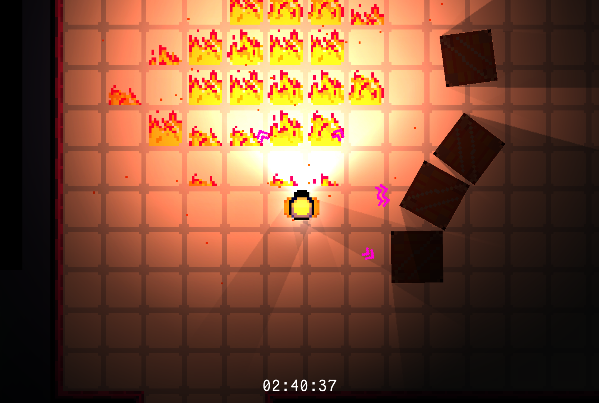
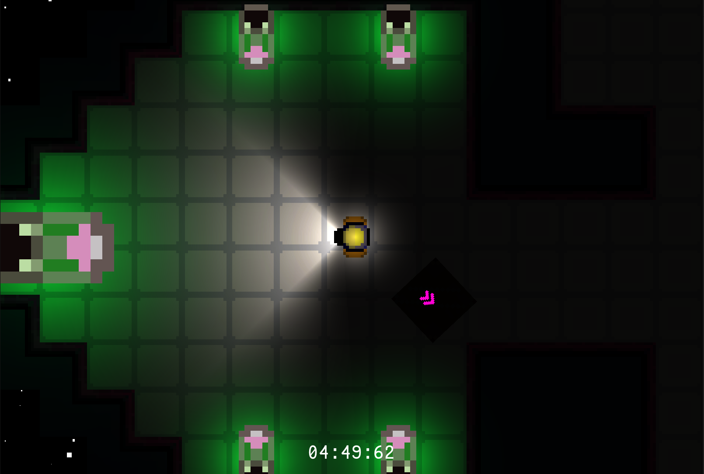

***Delay the inevitable*** to get back to earth safely! Will you survive while ***Reaching Home?***

*"Thank you for choosing our flight services. We will be arriving to our destination in approximately 4 minutes and 20 seconds. In the meanwhile, sit back and relax."*

In this chaotic survival game, your task is to keep the space ship running to reach it's destination. The destruction of the space ship is inevitable, but can you delay your doom just enough to reach home?

**Controls:**
- **Move: WASD** (or Arrows)
- **Interact: E** (or F or Ctr)
- **Fire Extinguisher: Space** (or Numpad 0)

This is fine ':)

Life Supoort operating within nominal values. 

**More information**
**Status**	Released
**Platforms**	HTML5
**Genre**	Action, Survival
**Made with**	Unity, Audacity, Paint.net
**Tags**	2D, Difficult, Ludum Dare, ludum-dare-50, Pixel Art, Sci-fi, Short, Space, Top-Down
**Average session**	A few minutes
